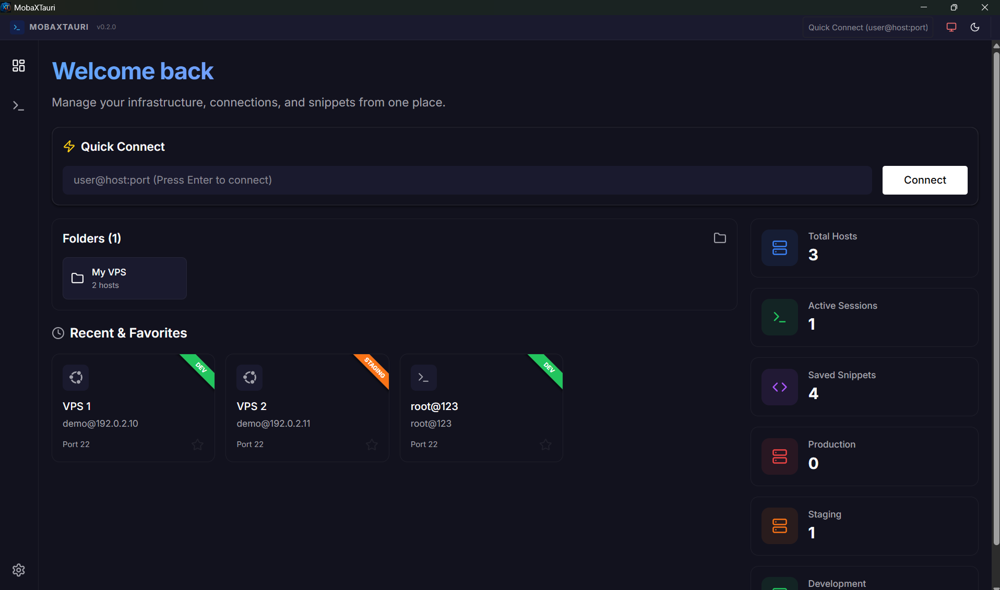
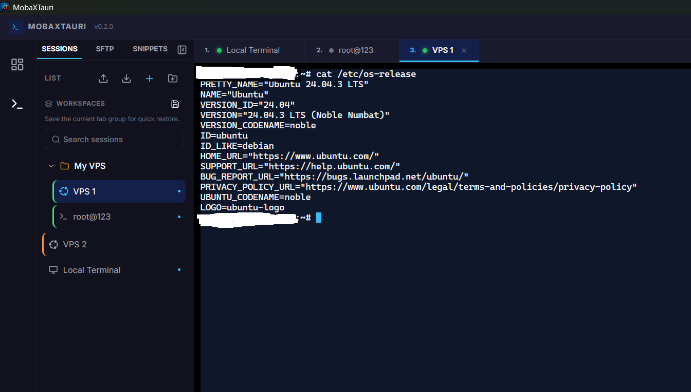
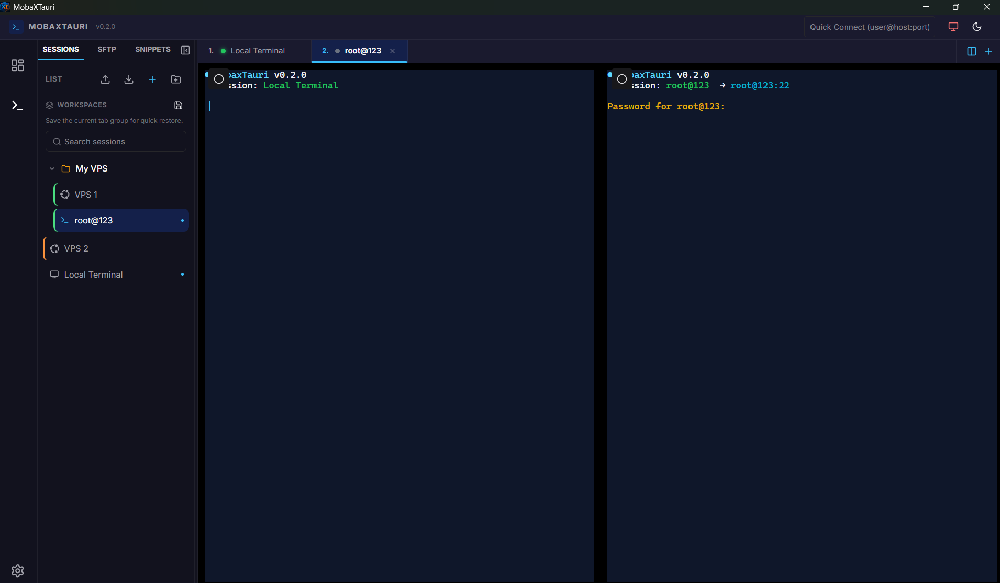
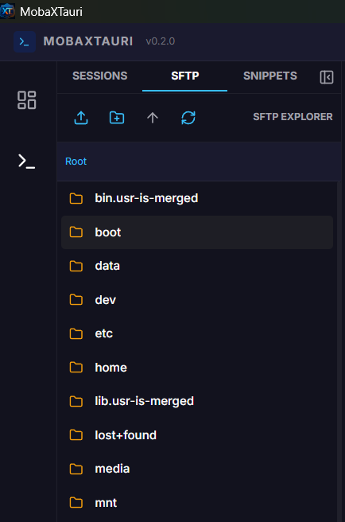
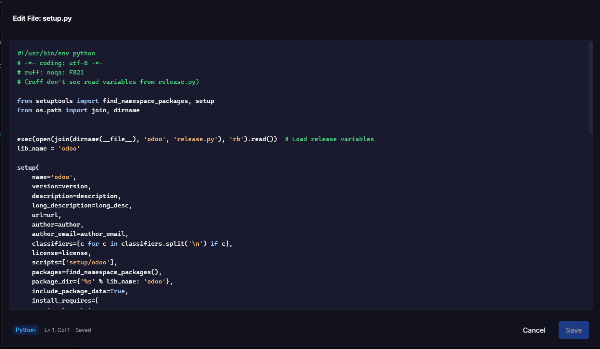
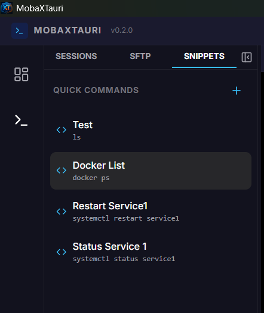
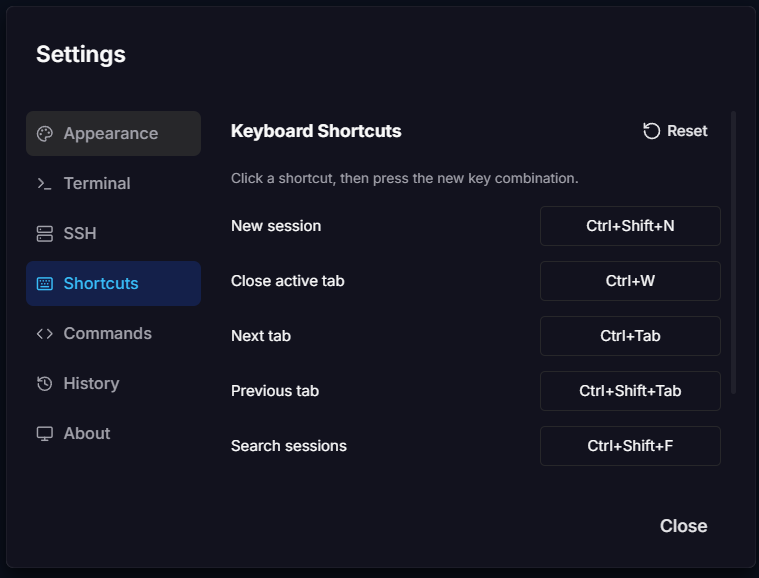

# MobaXTauri

> An open-source SSH terminal and SFTP desktop client built with Tauri, Rust, React, and TypeScript.

[](https://github.com/dimastriann/mobaxtauri/releases)
[](LICENSE)
[](#download)
[](#project-status)

MobaXTauri is a lightweight, cross-platform desktop application for organizing SSH connections, working in multiple terminal sessions, and browsing remote files over SFTP. It is inspired by MobaXterm and is being developed in the open as a full-stack desktop application.

## Screenshots



| SSH terminal | Split terminal |
| :---: | :---: |
|  |  |

| SFTP explorer | Remote file editor |
| :---: | :---: |
|  |  |

| Command snippets | Configurable shortcuts |
| :---: | :---: |
|  |  |

## Project status

MobaXTauri is **early-beta software**. The main workflows are implemented, but it has not yet received broad platform, server, or security testing. It is suitable for evaluation and development; do not use it for production-sensitive systems yet.

In particular, the current SSH client accepts server host keys without verifying them. Host-key verification is the highest-priority item on the [roadmap](ROADMAP.md).

## Features

| Area | Current capability |
| :--- | :--- |
| SSH terminal | Multiple Xterm.js terminal tabs backed by asynchronous Rust SSH sessions |
| Authentication | Password and OpenSSH private-key authentication |
| SFTP | Browse, upload, download, copy, rename, edit, create, and delete remote files and directories |
| Session management | Folders, drag and drop, environment tags, saved tab workspaces, and quick connect |
| Productivity | Command snippets, command palette, configurable shortcuts, terminal search, and recording export |
| Import and export | Application backup/restore, OpenSSH config import, and MobaXterm bookmark import |
| Host information | Linux-focused OS detection and CPU, memory, swap, and disk health display |
| Local security | Saved passwords are stored in a local Tauri Stronghold vault rather than the session store |
| Interface | Responsive dashboard, dark/light themes, and persistent background terminal views |

## Architecture

MobaXTauri demonstrates a complete desktop stack:

```text
React + TypeScript UI
        │ Tauri commands and events
        ▼
Rust async backend (Tokio)
        │
        ├── russh / russh-sftp ──► remote SSH servers
        ├── Tauri Stronghold ─────► local credential vault
        └── Tauri Store ──────────► local sessions and preferences
```

| Layer | Technology |
| :--- | :--- |
| Desktop runtime | Tauri v2 |
| Frontend | React 19, TypeScript, Chakra UI v3 |
| State management | Zustand |
| Terminal | Xterm.js |
| Backend | Rust and Tokio |
| SSH / SFTP | `russh` and `russh-sftp` |
| Credential storage | Tauri Stronghold and Argon2id |
| Tooling | Vite, Vitest, Testing Library, ESLint, Prettier, Clippy |

## Download

Published builds are available on the [GitHub Releases page](https://github.com/dimastriann/mobaxtauri/releases). Because this is early-beta software, review the release notes and known limitations before running a build.

The release workflow is configured to produce Windows MSI/NSIS installers and a portable executable, a macOS DMG, and Linux DEB/AppImage packages. A package appearing in the workflow does not yet mean it has been tested on every OS distribution or hardware configuration.

## Development setup

### Prerequisites

- Node.js 20 or newer (the release workflow uses Node.js 22)
- Rust stable
- Platform prerequisites from the [Tauri v2 documentation](https://v2.tauri.app/start/prerequisites/)

On Ubuntu/Debian, the release workflow installs:

```bash
sudo apt-get update
sudo apt-get install -y libgtk-3-dev libwebkit2gtk-4.1-dev libappindicator3-dev librsvg2-dev patchelf
```

### Run locally

```bash
git clone https://github.com/dimastriann/mobaxtauri.git
cd mobaxtauri
npm install
npm run tauri dev
```

Build installers for the current platform with:

```bash
npm run tauri build
```

Build artifacts are written under `src-tauri/target/release/bundle/`.

## Quality checks

| Command | Purpose |
| :--- | :--- |
| `npm run test -- --run` | Run frontend unit/component tests once |
| `npm run build` | Type-check and build the frontend |
| `npm run lint` | Run ESLint |
| `npm run format:check` | Check frontend formatting |
| `cargo test --manifest-path src-tauri/Cargo.toml` | Run Rust tests |
| `npm run lint:rust` | Run Clippy |
| `npm run project:check` | Run the combined TypeScript, lint, formatting, and Clippy checks |

Tagged releases run frontend and Rust tests, then build draft releases on Windows, macOS, and Ubuntu through GitHub Actions.

## Data and security

Application data stays on the local machine unless you explicitly connect to a remote SSH server. Session metadata and preferences use Tauri Store. Passwords selected for saving are kept separately in a Tauri Stronghold vault.

| Data | Windows | macOS | Linux |
| :--- | :--- | :--- | :--- |
| Session store | `%APPDATA%\\com.dn201.mobaxtauri` | `~/Library/Application Support/com.dn201.mobaxtauri` | `~/.config/com.dn201.mobaxtauri` |
| Credential vault | Application data directory, `vault-v2.hold` | Application data directory, `vault-v2.hold` | Application data directory, `vault-v2.hold` |

Exact application-data paths can vary by OS packaging. See [SECURITY.md](SECURITY.md) for the current security model, limitations, and responsible disclosure instructions.

## Contributing

Contributions are welcome, including documentation, tests, platform reports, UX improvements, and Rust or React changes. Start with:

1. Read [CONTRIBUTING.md](CONTRIBUTING.md) and the [Code of Conduct](CODE_OF_CONDUCT.md).
2. Review the [roadmap](ROADMAP.md).
3. Choose an issue labeled `good first issue` or `help wanted`, or open a proposal before a large change.
4. Submit a focused pull request with tests or clear manual verification notes.

Security vulnerabilities should not be filed as public issues; follow [SECURITY.md](SECURITY.md).

## License

MobaXTauri is available under the [MIT License](LICENSE).
